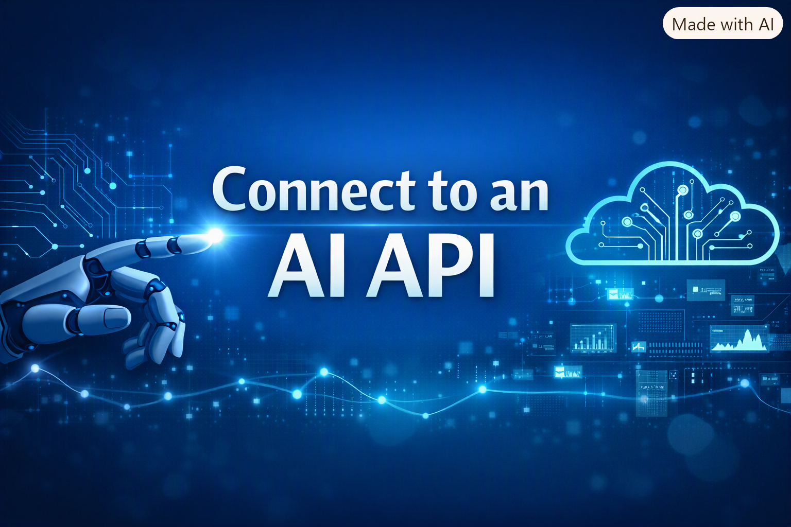
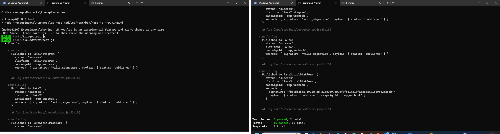

# FlyRank Capstone — Multi‑Platform Social Campaign Publisher + LLM API Integration


---

## Overview

This project demonstrates **backend reliability engineering** by combining:
- A simulated social campaign publisher (with fake platform adapters and durable queue worker).
- An **LLM‑backed API endpoint** (`/triage`) that classifies support messages into structured JSON output.

The goal is to show how to integrate an LLM safely into a backend system — with **timeouts, retries, schema validation, and a kill switch** — while simulating realistic publishing flows without touching real social accounts.

---

## Architecture Diagram
Campaign Publisher
├─► Caption Composer ─► per‑platform captions
└─► Queue Worker ─► SocialPublisher interface
├── FakeInstagram adapter
├── FakeX adapter
└── FakeSocialPlatform ─► signed webhook
├─ valid → status updated
└─ forged → 400 rejected


**LLM API Endpoint (`/triage`):**
- **Input:** `{ "text": "string" }`
- **Output:** `{ "category", "urgency", "confidence", "reason" }`
- **Reliability Guards:** timeout handling, transient retry, repair fallback, schema validation, kill switch.

---

## Setup Instructions

### Prerequisites
- Node.js (>=18)
- npm
- Git
- SQLite (local file database)
- OpenRouter account (for free LLM API key)

### Installation
```bash
git clone https://github.com/<your-username>/flyrank-be07-connect-ai-api.git
cd flyrank-be07-connect-ai-api
npm install

```
---

### Environment Variables
Create a .env file based on .env.example:

```bash
cp .env.example .env

```

Fill in real values in .env:

```bash
SECRET_KEY=my_secret_key_here
PORT=3000

# --- LLM Integration ---
OPENROUTER_API_KEY=sk-your-real-key-here
LLM_DISABLED=false

```
- **OPENROUTER_API_KEY**: your free API key from 

- **LLM_DISABLED**: set to true to disable all LLM calls instantly.

---

### Run

```bash
npm start

```

### Tests
Run all automated tests:

```bash
npm test
```
---

### ✅ Test Evidence

All automated tests passed successfully, demonstrating reliability of the triage route and queue worker.




### 📑 Required Files


- `README.md` — this file

- `capstone.yaml` — manifest for evaluator

- `EVIDENCE.md` — proofs for definition‑of‑done

- `BUILDLOG.md` — AI usage log

- `.env.example` — safe placeholder values

- `.env` — actual runtime secrets (ignored by Git)


---

### Reliability Highlights
- **Idempotency**: verified in publish logs

- **Retry‑After**: respected on simulated 429 responses

- **Webhook Security**: forged payloads rejected via signature validation

- **Crash Recovery**: durable worker restart confirmed

- **LLM Safety**: kill switch and schema validation prevent malformed output

---

### ⚠️ Limitations
- No polished frontend UI — API + status table only

- Fake platform adapters simulate publishing; real platform publishing is optional stretch goal

- Focus is backend reliability, not artistic image quality

---

### 📜 License
MIT License — free to use and learn from.

---

### 🌟 Portfolio Highlight

  
✅ **Backend AI Engineer** — I design and ship production AI systems — from optimized models and ML pipelines to full-stack React/Node apps running on automated, containerized infrastructure. I turn research into reliable, measurable software.

---


 © Leonard Phokane 2026. All rights reserved.